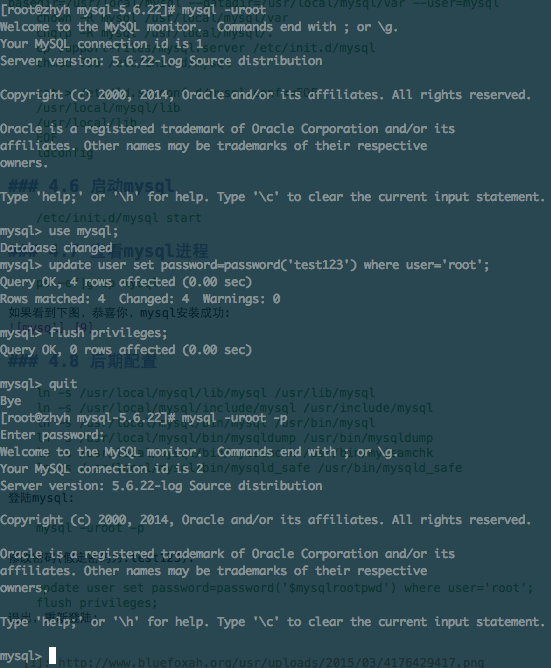

# Linux 安装 MySQL

本次安装的mysql版本是5.6.选择从搜狐源下载，编译过程漫长。

## 1.下载

```shell
wget http://mirrors.sohu.com/mysql/MySQL-5.6/mysql-5.6.23.tar.gz
```


## 2.解压编译

执行如下命令:

```shell
tar -zxvf mysql-5.6.23.tar.gz
cd mysql-5.6.23
cmake -DCMAKE_INSTALL_PREFIX=/usr/local/mysql -DEXTRA_CHARSETS=all -DDEFAULT_CHARSET=utf8 -DDEFAULT_COLLATION=utf8_general_ci -DWITH_READLINE=1 -DWITH_SSL=system -DWITH_ZLIB=system -DWITH_EMBEDDED_SERVER=1 -DENABLED_LOCAL_INFILE=1
make -j 2 && make install
```

编译将是一个漫长得过程。。。不同的机器性能等待时间不同。

make的-j参数可以使make进行并行编译。我cpu的核心数是2，所以指定为2.

## 3.添加mysql用户

```shell
groupadd mysql
useradd -s /sbin/nologin -M -g mysql mysql
```

## 4.修改配置文件

```shell
vim /etc/my.cnf
```

下面给出一份参考配置(只是测试用，如果要用于生产环境，请自行调配):

```
# Example MySQL config file for medium systems.

# The following options will be passed to all MySQL clients
[client]
#password  = your_password
port        = 3306
socket      = /tmp/mysql.sock
default-character-set=utf8mb4

# Here follows entries for some specific programs

# The MySQL server
[mysqld]
bind-address=127.0.0.1
port        = 3306
socket      = /tmp/mysql.sock
datadir = /usr/local/mysql/var
collation-server    = utf8mb4_general_ci
character-set-server = utf8mb4
skip-external-locking
key_buffer_size = 16M
max_allowed_packet = 1M
table_open_cache = 64
sort_buffer_size = 512K
net_buffer_length = 8K
read_buffer_size = 256K
read_rnd_buffer_size = 512K
myisam_sort_buffer_size = 8M

# Replication Master Server (default)
# binary logging is required for replication
log-bin=mysql-bin

# binary logging format - mixed recommended
binlog_format=mixed

# required unique id between 1 and 2^32 - 1
# defaults to 1 if master-host is not set
# but will not function as a master if omitted
server-id  = 1

# Uncomment the following if you are using InnoDB tables
innodb_data_home_dir = /usr/local/mysql/var
innodb_data_file_path = ibdata1:10M:autoextend
innodb_log_group_home_dir = /usr/local/mysql/var
# You can set .._buffer_pool_size up to 50 - 80 %
# of RAM but beware of setting memory usage too high
innodb_buffer_pool_size = 16M
innodb_additional_mem_pool_size = 2M
# Set .._log_file_size to 25 % of buffer pool size
innodb_log_file_size = 5M
innodb_log_buffer_size = 8M
innodb_flush_log_at_trx_commit = 1
innodb_lock_wait_timeout = 50

[mysqldump]
quick
max_allowed_packet = 16M

[mysql]
no-auto-rehash
# Remove the next comment character if you are not familiar with SQL
#safe-updates
default-character-set=utf8mb4

[myisamchk]
key_buffer_size = 20M
sort_buffer_size = 20M
read_buffer = 2M
write_buffer = 2M

[mysqlhotcopy]
interactive-timeout
```

## 5.初始化mysql

```shell
/usr/local/mysql/scripts/mysql_install_db --defaults-file=/etc/my.cnf --basedir=/usr/local/mysql --datadir=/usr/local/mysql/var --user=mysql
chown -R mysql /usr/local/mysql/var
chgrp -R mysql /usr/local/mysql/.
cp support-files/mysql.server /etc/init.d/mysql
chmod 755 /etc/init.d/mysql

cat > /etc/ld.so.conf.d/mysql.conf<<EOF
/usr/local/mysql/lib
/usr/local/lib
EOF
ldconfig

```

## 6.启动mysql

```shell
/etc/init.d/mysql start
```

## 7.查看mysql进程

```shell
ps -ef|grep mysql
```

如果看到下图，恭喜你，mysql安装成功:


## 8.后期配置

```shell
ln -s /usr/local/mysql/lib/mysql /usr/lib/mysql
ln -s /usr/local/mysql/include/mysql /usr/include/mysql
ln -s /usr/local/mysql/bin/mysql /usr/bin/mysql
ln -s /usr/local/mysql/bin/mysqldump /usr/bin/mysqldump
ln -s /usr/local/mysql/bin/myisamchk /usr/bin/myisamchk
ln -s /usr/local/mysql/bin/mysqld_safe /usr/bin/mysqld_safe
```

登陆mysql:

```shell
mysql -uroot -p
```


修改密码(假定密码为:test123):

```shell
use mysql;
update user set password=password('$mysqlrootpwd') where user='root';
flush privileges;
```

退出，重新登陆:

```shell
mysql -uroot -p
```

整个过程如下图:



## 9.结束

至此，mysql 已经安装结束。退出到上一层目录

```shell
cd ../
```

## 10.开机启动

```shell
chkconfig --level 345 mysqld on
```

